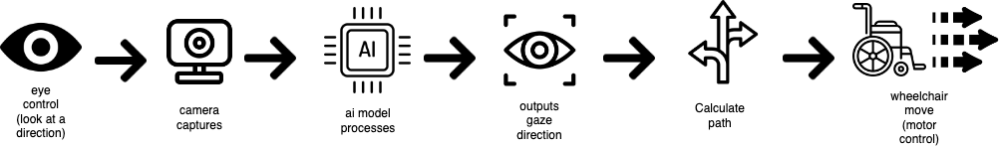
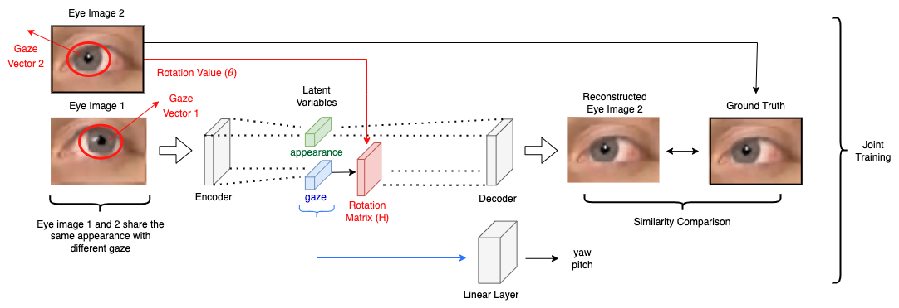
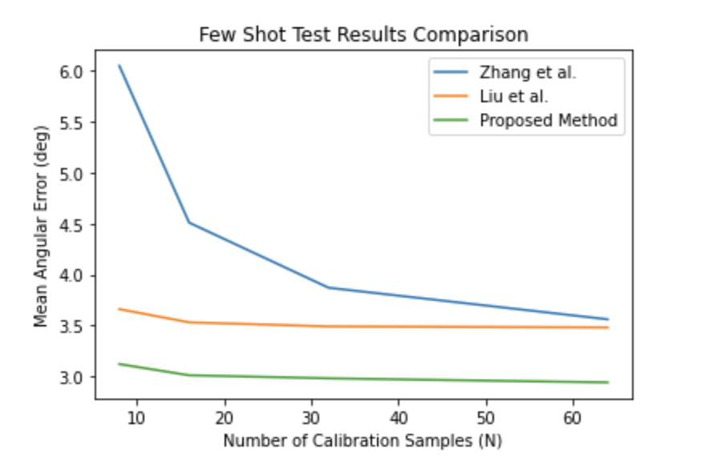
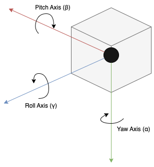
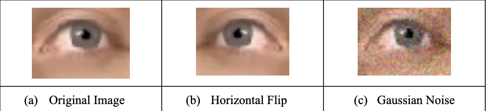
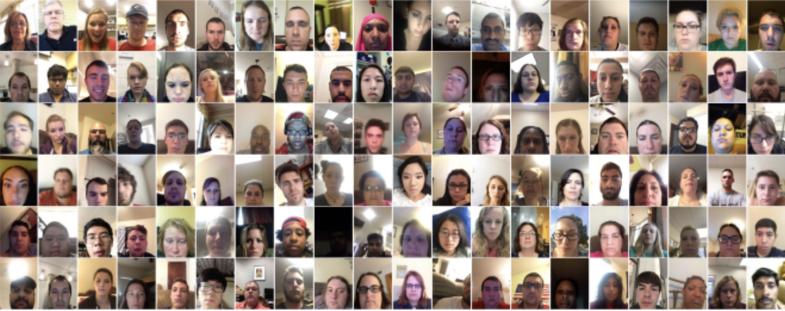

# Gaze-Enabled Wheelchair Model

An ongoing project to develop a wheelchair fully-automated using gaze estimation.

Allows users to freely control a powered wheelchair via their occular motor functions (eye movement and focus) without the use of their hands. Aimed to provide individuals with lower body and hand impairment with a method of movement and communication. 

The steps of applying my gaze estimation method to the wheelchair model can be outlined follows:

I use a RaspberryPi to infernece gaze through a model implemented using Python, which then sends designated commands to the arduino-controlled motors. 

# Proposed Gaze Estimation Method and Results
The method is composed of an autoencoder-based reconstruction model and GazeMLP linear layers for final infernece. 

The overall architecture is shown below:

A rotation matrix is applied to the latent variables outputted by the Encoder equivalent of the proposed method. This redirection helps to better disentangle the gaze-relevant and non-relevant latent variables and ultimately improves the accuracy of gaze estimation overall. 

The experimental results in comparison to previous state-of-the-art methods using a few-shot test are shown below:

To apply and assess the rotation matrix, euler angles are utilized. Euler angles are commonly represented in the 3-dimensional space using the three axes (pitch, roll, yaw) as shown below:

To increase the accuracy of my model and expose it to a wide range of possible inputs in the real-world including inverts and random noise, I also applied two data augmentation techniques, Horizontal Flip and Gaussian Noise:

I trained my model and applied data augmentation techniques to the GazeCapture dataset, which features eye images from 1,474 different individuals totaling to 2,445,504 discrete images. A snapshot of the dataset is shown below:

*Learn more about this open source dataset by MIT here: https://gazecapture.csail.mit.edu/*
